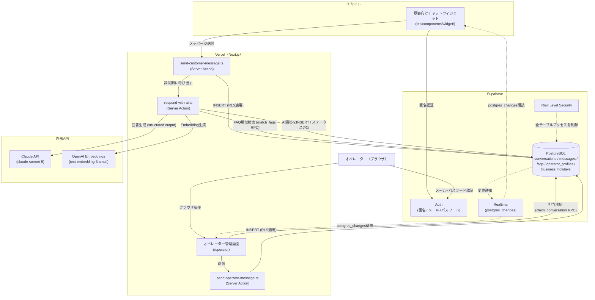
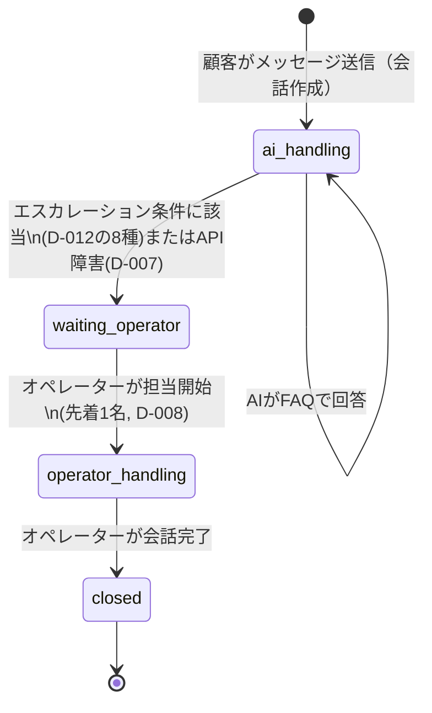

# アーキテクチャ設計書

## 1. 全体構成

```text
ECサイト
  └─ 顧客向けチャットウィジェット
       ├─ メッセージ送信
       ├─ 会話履歴表示
       └─ Realtime購読
                │
                ▼
        Next.js Server Actions / API
                │
       ┌────────┴────────┐
       ▼                 ▼
Supabase              Claude API
Auth / DB /           FAQ回答生成
Realtime / RLS        エスカレーション判定
       │
       ▼
オペレーター管理画面
  ├─ 会話一覧
  ├─ 会話詳細
  ├─ 担当者割当
  └─ 返信
```

## 2. 採用技術

| 領域 | 技術 |
|---|---|
| 顧客UI | React / Next.js |
| 管理画面 | Next.js |
| ホスティング | Vercel |
| DB | Supabase PostgreSQL |
| 認証 | Supabase Auth |
| リアルタイム通信 | Supabase Realtime |
| 権限制御 | Supabase RLS |
| AI | Claude API |
| FAQ検索 | pgvector |
| 言語 | TypeScript |
| UI | Tailwind CSS |

## 3. 3領域の担当

### 顧客チャットUI
- 匿名セッション開始
- 会話作成
- メッセージ送信
- 会話履歴表示
- Realtime購読
- AI対応中・人間対応待ち・人間対応中の状態表示

### AIバックエンド
- 顧客メッセージ保存
- FAQ検索
- Claude API呼び出し
- 回答生成
- 回答根拠不足時の抑制
- エスカレーション判定
- カテゴリ判定
- AI回答保存
- 会話ステータス更新

### オペレーター管理画面
- ログイン
- 会話一覧
- 会話詳細
- 担当者割当
- オペレーター返信
- 会話完了
- Realtime購読

## 4. データフロー

### FAQで回答できる場合
1. 顧客がメッセージ送信
2. messagesへ保存
3. FAQを検索
4. 関連FAQをClaudeへ渡す
5. Claudeが回答
6. AI回答をmessagesへ保存
7. Realtimeで顧客画面へ表示

### 人間対応が必要な場合
1. 顧客がメッセージ送信
2. FAQ検索
3. 根拠不足または人間対応条件に該当
4. conversations.statusを`waiting_operator`へ変更
5. 管理画面へ即時表示
6. オペレーターが担当開始
7. `operator_handling`へ変更
8. オペレーター返信を保存
9. Realtimeで顧客画面へ表示

## 5. 共通型

```ts
export type ConversationStatus =
  | "ai_handling"
  | "waiting_operator"
  | "operator_handling"
  | "closed";

export type SenderType =
  | "customer"
  | "ai"
  | "operator"
  | "system";

export type ConversationCategory =
  | "inventory"
  | "product"
  | "shipping"
  | "return"
  | "other";

export type EscalationReason =
  | "customer_request"
  | "faq_not_found"
  | "low_similarity"
  | "order_specific"
  | "refund_or_payment_issue"
  | "complaint"
  | "ai_uncertain"
  | "ai_api_error";
```

## 6. 推奨ディレクトリ

```text
src/
├─ app/
│  ├─ operator/
│  ├─ api/
│  └─ widget-preview/
├─ components/
│  ├─ widget/
│  ├─ operator/
│  └─ common/
├─ features/
│  ├─ conversations/
│  ├─ messages/
│  ├─ faq/
│  └─ ai/
├─ lib/
│  ├─ supabase/
│  ├─ anthropic/
│  ├─ validation/
│  └─ auth/
├─ types/
│  └─ domain.ts
└─ actions/
   ├─ send-customer-message.ts
   ├─ respond-with-ai.ts
   └─ send-operator-message.ts
```

## 7. 領域ごとの担当範囲と境界ルール

### 共通基盤（mainブランチで管理）

以下はWorktreeへ分割する前にmainブランチで確定し、各担当が独断で変更しない。

- DBスキーマ
- Supabaseマイグレーション
- RLSポリシー
- Supabaseクライアント設定
- 共通TypeScript型
- 環境変数の定義
- 会話ステータス
- 問い合わせカテゴリ
- 送信者種別
- ステータス遷移ルール

### 顧客チャットUI担当

担当する主なファイル:

```text
src/components/widget/
src/app/widget-preview/
src/actions/send-customer-message.ts
```

変更しない:
- src/features/ai/
- src/features/faq/
- src/actions/respond-with-ai.ts
- src/app/operator/
- src/components/operator/
- src/actions/send-operator-message.ts
- DBスキーマ、マイグレーション、RLSポリシー

### AIバックエンド担当

担当する主なファイル:

```text
src/features/ai/
src/features/faq/
src/actions/respond-with-ai.ts
```

変更しない:
- src/components/widget/
- src/app/widget-preview/
- src/actions/send-customer-message.ts
- src/app/operator/
- src/components/operator/
- src/actions/send-operator-message.ts
- DBスキーマ、マイグレーション、RLSポリシー

### オペレーター管理画面担当

担当する主なファイル:

```text
src/app/operator/
src/components/operator/
src/actions/send-operator-message.ts
```

変更しない:
- src/components/widget/
- src/app/widget-preview/
- src/actions/send-customer-message.ts
- src/features/ai/
- src/features/faq/
- src/actions/respond-with-ai.ts
- DBスキーマ、マイグレーション、RLSポリシー

## 8. 境界ルール
- 顧客UIはClaude APIを直接呼ばない
- 管理画面はAIロジックを持たない
- AIバックエンドはUIコードを変更しない
- 共通型・DBスキーマ・RLSはmainで確定する
- DB変更が必要な場合は独断で変更せず設計へ戻る

## 9. アーキテクチャ図

### 9.1 システム構成図



### 9.2 会話ステータス遷移図



備考: `is_after_hours`はステータスとは独立したフラグ（D-006）。`waiting_operator`中に営業時間外かどうかを管理画面で判別するために使う。